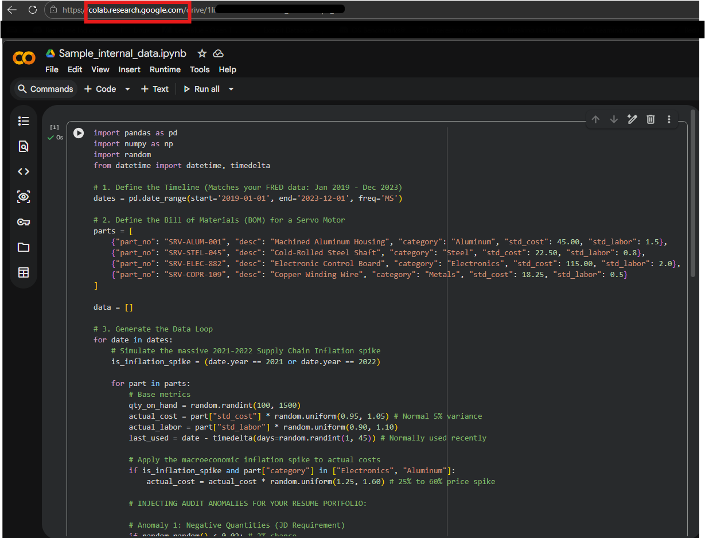
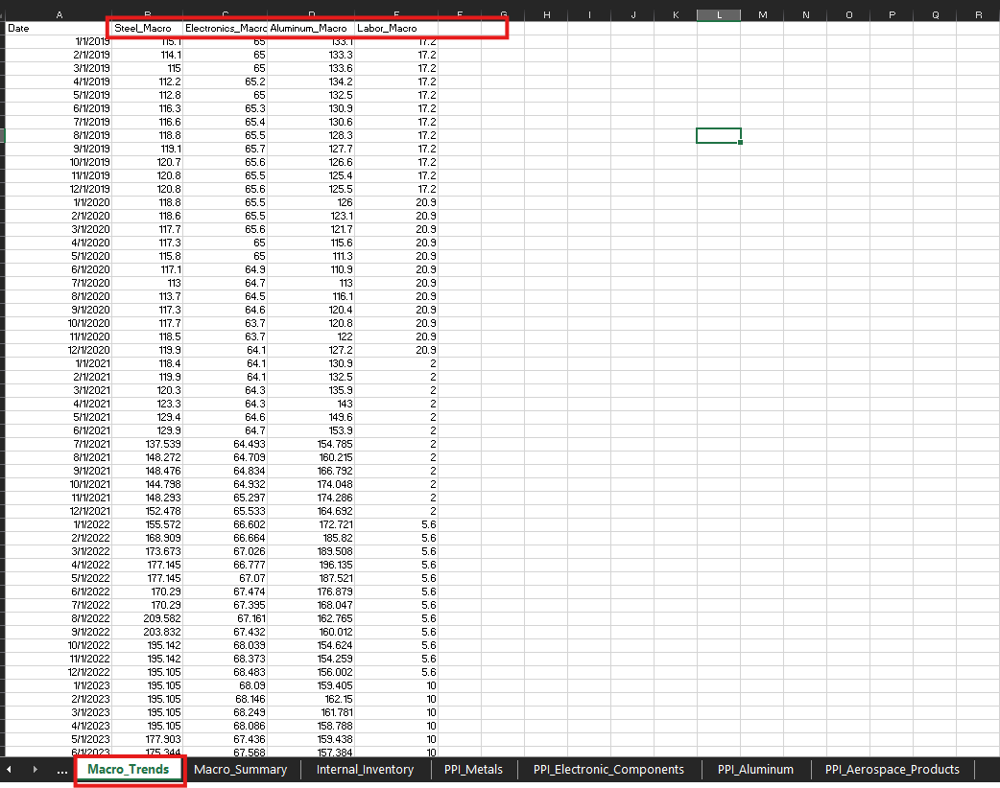
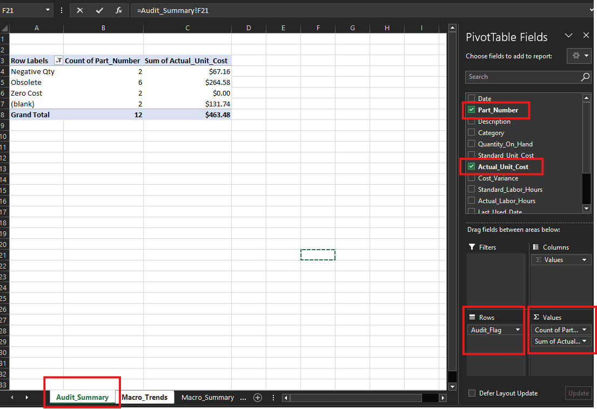
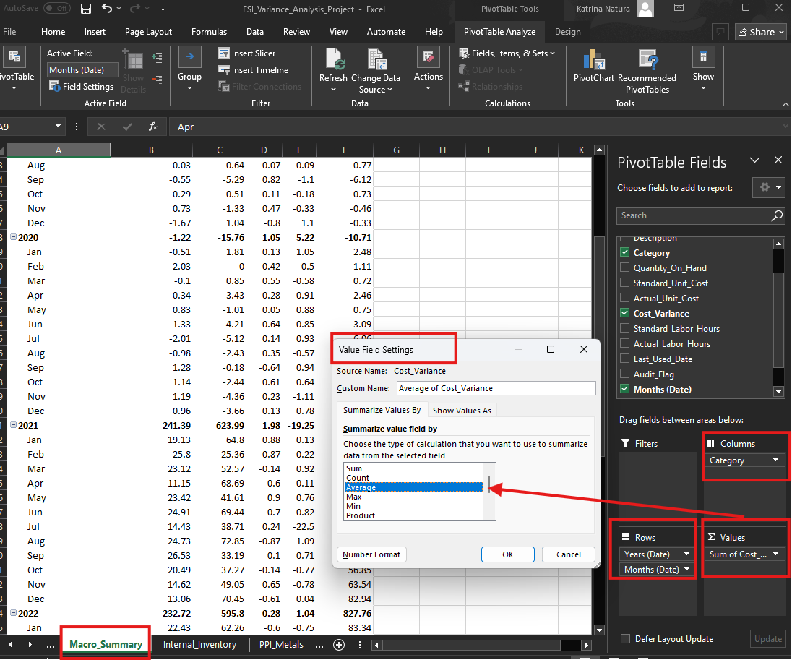
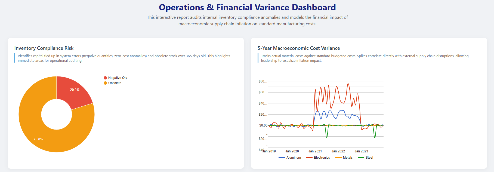
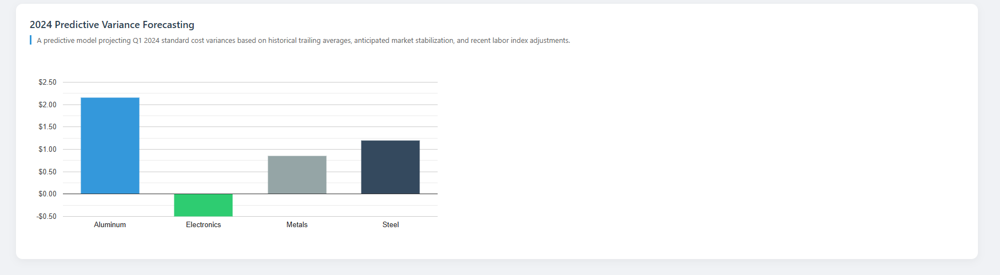

# 📊 Manufacturing Cost Variance & Inventory Compliance Audit Model

## 🎯 Executive Summary
This project demonstrates an end-to-end **financial data engineering and variance analysis workflow** tailored for high-performance hardware manufacturing. By correlating internal inventory logs with external macroeconomic data, this model provides actionable insights into:

* **Strategic Forecasting:** Quantifying the $ impact of supply chain inflation (2019–2023).
* **Operational Compliance:** Identifying capital risk through automated auditing of system anomalies.
* **Automated Reporting:** A live, secure dashboard deployed via Google Apps Script.

---

## 🏗️ Part 1: Data Sourcing & Generation
To ensure the model reflected real-world aerospace manufacturing conditions, internal data was time-synced with **FRED (Federal Reserve Economic Data)** price indices for Steel, Electronics, and Aluminum.

### **External Macroeconomic Data (FRED)**
Historical index data was sourced directly from the [Federal Reserve Economic Data (FRED)](https://fred.stlouisfed.org/) database to track the core components of servo-motor manufacturing:

* **Steel:** [Producer Price Index: Metals and Metal Products: Steel Wire, Stainless Steel](https://fred.stlouisfed.org/series/WPU10170502)
* **Electronics:** [Producer Price Index: Machinery and Equipment: Electronic Components](https://fred.stlouisfed.org/series/WPS1178)
* **Aluminum:** [Producer Price Index: Alumina and Aluminum Production and Processing](https://fred.stlouisfed.org/series/PCU3313133131)
* **Labor:** [Unit Labor Costs for Manufacturing: Aerospace Product and Parts Manufacturing](https://fred.stlouisfed.org/series/IPUEN3364U101000000)

### **Internal Data Synthesis**
I utilized a Python script to engineer a 5-year monthly inventory history. I intentionally injected **compliance "bugs"**—such as negative quantities and zero-cost items—to demonstrate the model's auditing capabilities.

*Figure 1: Executing the synthesis script in Google Colab.*

---

## 🛠️ Part 2: Engineering & Transformation (Excel)
Disparate datasets were joined using advanced lookup logic. I utilized `VLOOKUP` with "Approximate Match" logic to cascade annual Labor Index data down into monthly manufacturing rows.

### **Core Data Architecture Formulas:**
* **Column B - Steel Integration Macro:** `=IFERROR(VLOOKUP($A2, PPI_Metals!$A:$B, 2, FALSE), "Not Found")`
* **Column C - Electronics Integration Macro:** `=IFERROR(VLOOKUP($A2, PPI_Electronic_Components!$A:$B, 2, FALSE), "Not Found")`
* **Column D - Aluminum Integration Macro:** `=IFERROR(VLOOKUP($A2, PPI_Aluminum!$A:$B, 2, FALSE), "Not Found")`
* **Column E - Labor Index Cascading Macro:** `=VLOOKUP($A2, PPI_Aerospace_Products!$A:$B, 2, TRUE)`

*Figure 2: The unified Macro_Trends table showing aligned internal/external data.*

---

## 🔍 Part 3: Financial Auditing & Variance Logic
I applied an "Audit-First" mindset to the dataset, creating automated flags for inventory governance.

### **Finding 1: High-Risk System Anomalies**
Using Pivot Tables, I quantified capital risk by "Audit Flag." 
> **📢 CRITICAL FINDING:** Analysis revealed that **Negative Quantity errors** represent over **20% of the total risk-weighted capital**, suggesting an immediate need for an operational workflow audit in the shipping/receiving department.

*Figure 3: Audit Summary identifying hidden financial risk.*

### **Finding 2: The 2021 Inflation Spike**
The model tracked a massive variance breakout starting in Q1 2021.
> **📊 STRATEGIC INSIGHT:** While Steel and Metals remained stable, **Electronics variance skyrocketed by over 500%**, directly correlating with the global semiconductor shortage reflected in FRED indices.

*Figure 4: Variance analysis highlighting the 2021 supply chain disruption.*

---

## 🚀 Part 4: Cloud Deployment & Visualization
To move beyond static spreadsheets, I built a custom **Cloud Dashboard** using Google Apps Script (JavaScript) and the Google Charts API.

### **Key Dashboard Features:**
1.  **Inventory Compliance Risk:** A real-time breakdown of capital tied up in system errors.
2.  **5-Year Trend Analysis:** Interactive line charts showing historical variance vs. standard cost.
3.  **2024 Predictive Modeling:** Uses trailing averages to forecast Q1 2024 variance targets.

---

## 📁 Repository Structure
* `Sample_Internal_Data_Script`: Python script for data synthesis.
* `Google_Apps_Script_Code.gs`: Backend server logic for the dashboard.
* `Google_Apps_Script_Index.html`: Frontend UI/UX for the interactive charts.
